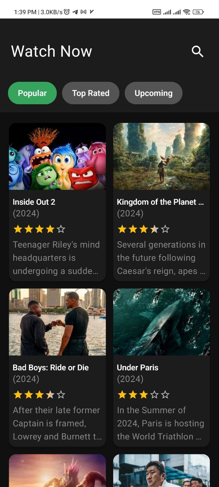
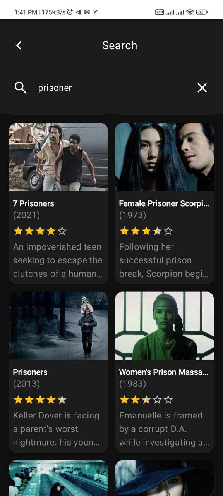
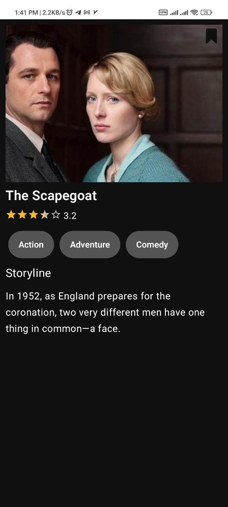

# General Introduction

This project has used the endpoints of themoviedb site, which you can see from [here](https://developer.themoviedb.org/reference/intro/getting-started).

In order to upload your own version, put your token in the local.properties file of your project with name API_KEY and leave the rest. Now you can have your own version.

# Technical introduction
The following dependencies are used:

- *Kotlin* as a programming language
- *Retrofit* to work with the network
- *Coil* for loading photos
- *Paging* for load lists based on need
- and *Hilt* for dependency injection
This project is written in *MVVM*.

# Screens
Generally we have three pages: *home*, *search* and *movie details*.
On the *home page*, you can see videos of different categories, these categories are:
popular, top-rated and upcoming. Also can search for a specific movie and go through move details.

...

Below you can see the image of these three pages

Home                                                                |                               Search                                |  Details
:------------------------------------------------------------------:|:-------------------------------------------------------------------:|:-----------------------------------------------------------------------------
          |         |   

# Future Works
- In some parts, ther are words and arrays were hardcoded and should be transferred to the string.xml file
- You can use caching for the coil
- Placeholder can be added before loading photos
